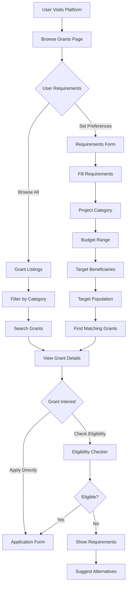
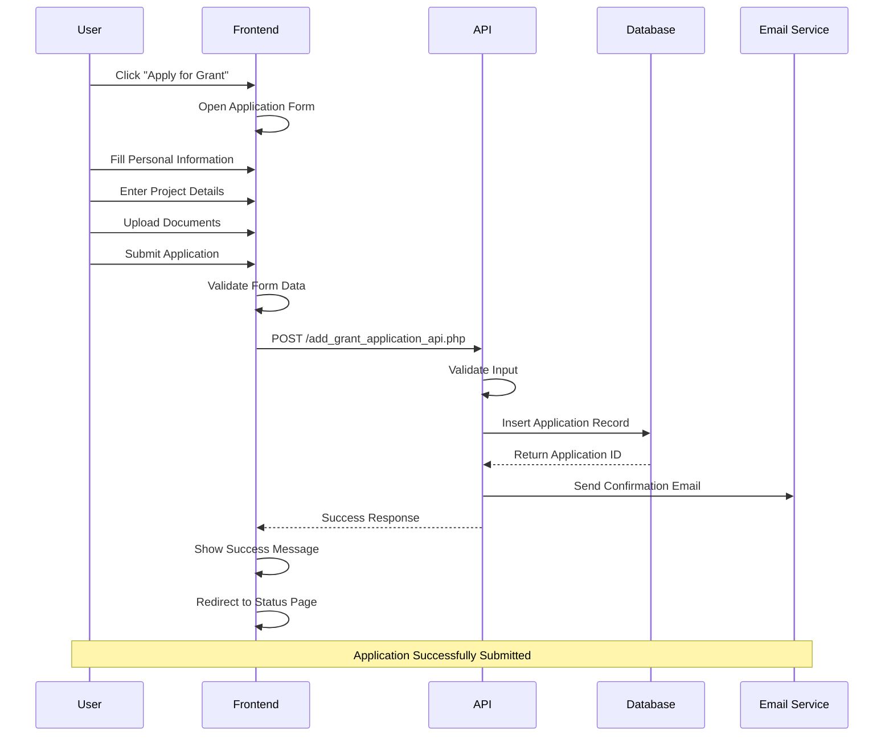
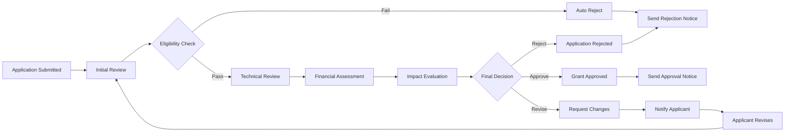
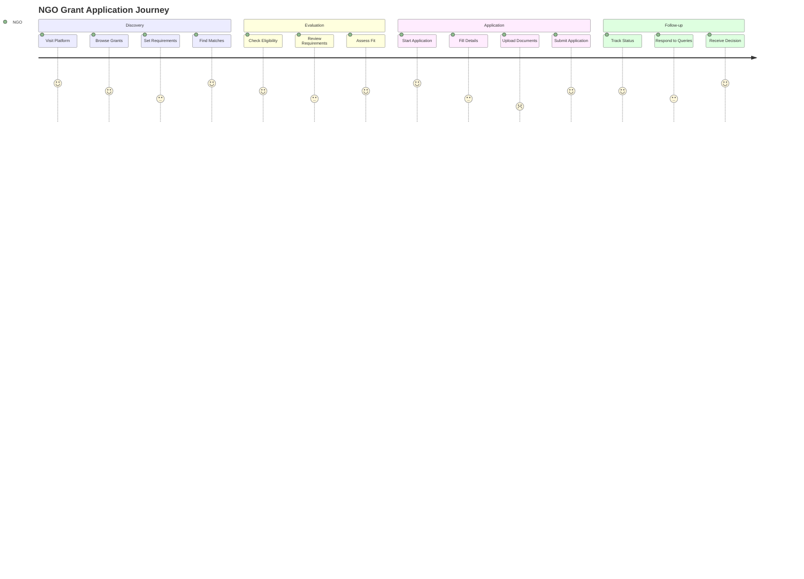
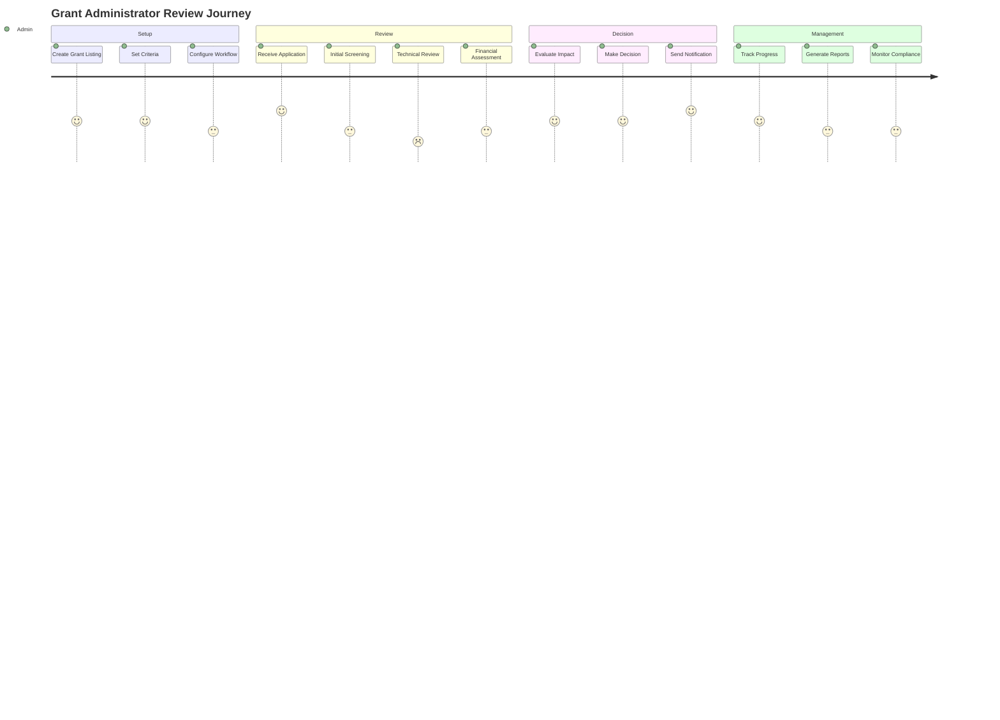
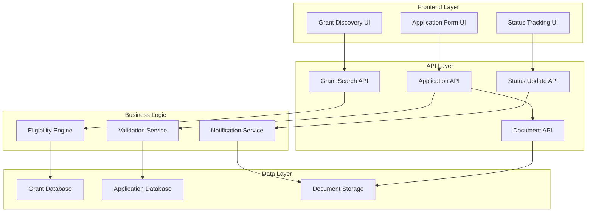

# Grant Application System Documentation

## ✅ SYSTEM STATUS: FULLY CONNECTED
**Frontend ↔ Backend Integration: COMPLETE**

## Table of Contents
1. [System Overview](#system-overview)
2. [Grant Application Flow](#grant-application-flow)
3. [User Journey Mapping](#user-journey-mapping)
4. [Technical Architecture](#technical-architecture)
5. [API Documentation](#api-documentation)
6. [Database Schema](#database-schema)
7. [Security & Compliance](#security--compliance)
8. [Integration Points](#integration-points)
9. [✅ Frontend-Backend Connection](#frontend-backend-connection)

---

## System Overview

The Grant Application System is a comprehensive platform designed to streamline the grant application process for NGOs and funding organizations. It provides an end-to-end solution from grant discovery to application submission and review.

### Key Features
- **Grant Discovery**: Browse available grants by category and eligibility
- **Application Management**: Complete application lifecycle management
- **Eligibility Checking**: Automated eligibility verification
- **Document Management**: Secure document upload and storage
- **Status Tracking**: Real-time application status updates
- **Review Workflow**: Structured review and approval process

### Supported Grant Categories
- **Education**: Digital literacy, infrastructure, capacity building
- **Healthcare**: Rural access, community health, medical infrastructure
- **Environment**: Climate action, biodiversity, green infrastructure
- **Disaster Response**: Preparedness, emergency response, rehabilitation

---

## Grant Application Flow

### 1. Grant Discovery Process



### 2. Application Submission Flow



### 3. Review and Approval Workflow



---

## User Journey Mapping

### 1. NGO Grant Seeker Journey



### 2. Grant Administrator Journey



---

## Technical Architecture

### Component Structure

```
Grant Application System
├── Frontend Components
│   ├── BrowseGrants.tsx
│   │   ├── Grant Discovery
│   │   ├── Requirements Form
│   │   ├── Grant Listings
│   │   └── Eligibility Checker
│   ├── GrantApplication.tsx
│   │   ├── Domain Selection
│   │   ├── Application List
│   │   └── Status Management
│   └── GrantApplicationForm.tsx
│       ├── Personal Information
│       ├── Project Details
│       ├── Financial Information
│       └── Document Upload
├── Backend APIs
│   ├── add_grant_application_api.php
│   ├── get_grant_applications_api.php
│   ├── update_grant_status_api.php
│   └── grant_eligibility_api.php
├── Database Tables
│   ├── grant_applications
│   ├── grants
│   ├── eligibility_criteria
│   └── application_documents
└── Utilities
    ├── grantApplicationApi.js
    ├── Document Management
    └── Email Notifications
```

### Data Flow Architecture



---

## API Documentation

### Grant Application APIs

#### 1. Submit Grant Application
```http
POST /backend/add_grant_application_api.php
Content-Type: application/json

{
  "applicantName": "string",
  "applicantEmail": "string",
  "applicantPhone": "string",
  "organizationName": "string",
  "projectTitle": "string",
  "projectDescription": "string",
  "requestedAmount": number,
  "projectDuration": "string",
  "category": "education|healthcare|infrastructure|environment|other"
}
```

**Response:**
```json
{
  "success": true,
  "message": "Grant application submitted successfully",
  "id": "12345"
}
```

#### 2. Get Grant Applications
```http
GET /backend/get_grant_applications_api.php
```

**Response:**
```json
{
  "success": true,
  "data": [
    {
      "id": "12345",
      "applicantName": "John Doe",
      "projectTitle": "Digital Education Initiative",
      "requestedAmount": 500000,
      "status": "submitted",
      "submissionDate": "2025-01-15"
    }
  ]
}
```

#### 3. Update Application Status
```http
PUT /backend/update_grant_status_api.php
Content-Type: application/json

{
  "applicationId": "12345",
  "status": "approved|rejected|under-review",
  "reviewNotes": "string"
}
```

#### 4. Check Eligibility
```http
POST /backend/grant_eligibility_api.php
Content-Type: application/json

{
  "grantId": "string",
  "organizationType": "string",
  "projectCategory": "string",
  "requestedAmount": number,
  "organizationAge": number
}
```

---

## Database Schema

### Grant Applications Table
```sql
CREATE TABLE grant_applications (
    id INT PRIMARY KEY AUTO_INCREMENT,
    applicant_name VARCHAR(255) NOT NULL,
    applicant_email VARCHAR(255) NOT NULL,
    applicant_phone VARCHAR(20),
    organization_name VARCHAR(255),
    project_title VARCHAR(500) NOT NULL,
    project_description TEXT NOT NULL,
    requested_amount DECIMAL(15,2) NOT NULL,
    project_duration VARCHAR(100),
    category ENUM('education', 'healthcare', 'infrastructure', 'environment', 'other') NOT NULL,
    status ENUM('submitted', 'under-review', 'approved', 'rejected') DEFAULT 'submitted',
    submission_date TIMESTAMP DEFAULT CURRENT_TIMESTAMP,
    review_date TIMESTAMP NULL,
    reviewer_id INT NULL,
    review_notes TEXT NULL,
    created_at TIMESTAMP DEFAULT CURRENT_TIMESTAMP,
    updated_at TIMESTAMP DEFAULT CURRENT_TIMESTAMP ON UPDATE CURRENT_TIMESTAMP,
    
    INDEX idx_status (status),
    INDEX idx_category (category),
    INDEX idx_submission_date (submission_date)
);
```

### Grants Table
```sql
CREATE TABLE grants (
    id INT PRIMARY KEY AUTO_INCREMENT,
    title VARCHAR(500) NOT NULL,
    description TEXT NOT NULL,
    category VARCHAR(100) NOT NULL,
    amount DECIMAL(15,2) NOT NULL,
    deadline DATE NOT NULL,
    status ENUM('active', 'closed', 'draft') DEFAULT 'active',
    eligibility JSON,
    requirements JSON,
    created_by INT NOT NULL,
    created_at TIMESTAMP DEFAULT CURRENT_TIMESTAMP,
    updated_at TIMESTAMP DEFAULT CURRENT_TIMESTAMP ON UPDATE CURRENT_TIMESTAMP
);
```

### Application Documents Table
```sql
CREATE TABLE application_documents (
    id INT PRIMARY KEY AUTO_INCREMENT,
    application_id INT NOT NULL,
    document_name VARCHAR(255) NOT NULL,
    document_path VARCHAR(500) NOT NULL,
    document_type VARCHAR(100) NOT NULL,
    file_size INT NOT NULL,
    uploaded_at TIMESTAMP DEFAULT CURRENT_TIMESTAMP,
    
    FOREIGN KEY (application_id) REFERENCES grant_applications(id) ON DELETE CASCADE
);
```

---

## Security & Compliance

### Data Protection
- **Input Validation**: All form inputs are sanitized and validated
- **SQL Injection Prevention**: Prepared statements for all database queries
- **File Upload Security**: Type validation and size limits for documents
- **Access Control**: Role-based permissions for application management

### Privacy Compliance
- **Data Encryption**: Sensitive data encrypted at rest and in transit
- **Audit Trail**: Complete logging of all application activities
- **Data Retention**: Configurable retention policies for application data
- **GDPR Compliance**: Right to access, modify, and delete personal data

### Security Headers
```php
// CORS Configuration
header('Access-Control-Allow-Origin: http://localhost:5173');
header('Access-Control-Allow-Methods: POST, GET, PUT, DELETE, OPTIONS');
header('Access-Control-Allow-Headers: Content-Type, Authorization');

// Security Headers
header('X-Content-Type-Options: nosniff');
header('X-Frame-Options: DENY');
header('X-XSS-Protection: 1; mode=block');
```

---

## Integration Points

### Email Notifications
- **Application Confirmation**: Sent upon successful submission
- **Status Updates**: Automated notifications for status changes
- **Reminder Emails**: Deadline and follow-up reminders
- **Document Requests**: Notifications for additional documentation

### Document Management
- **File Upload**: Secure document upload with validation
- **Storage**: Organized file storage with access controls
- **Retrieval**: Efficient document retrieval for review
- **Backup**: Automated backup of all application documents

### Reporting Integration
- **Application Analytics**: Track application trends and success rates
- **Grant Performance**: Monitor grant program effectiveness
- **Compliance Reporting**: Generate regulatory compliance reports
- **Custom Reports**: Flexible reporting for stakeholder needs

---

*Document Version: 1.0*  
*Last Updated: January 15, 2025*  
*Author: Grant Application Team*