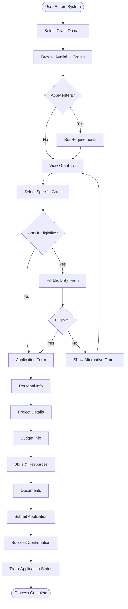
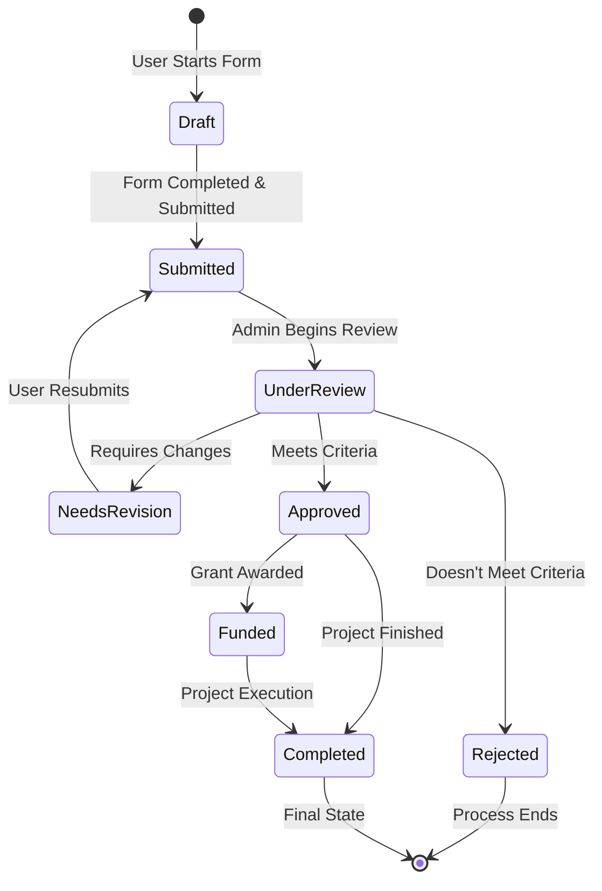
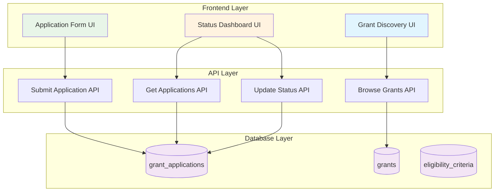
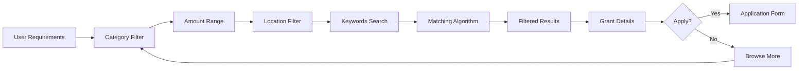
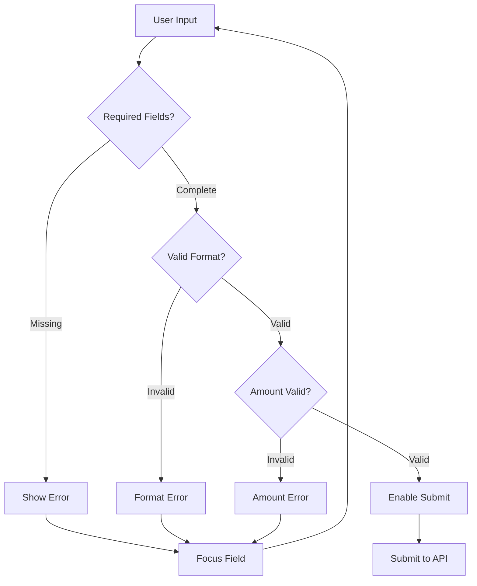
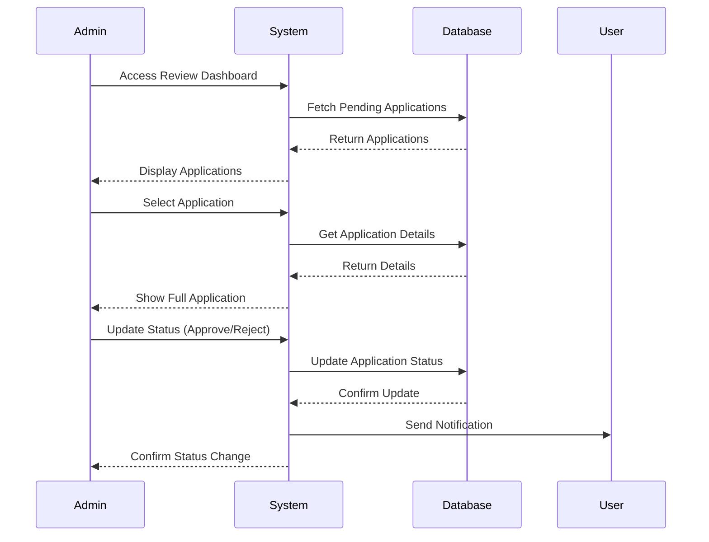
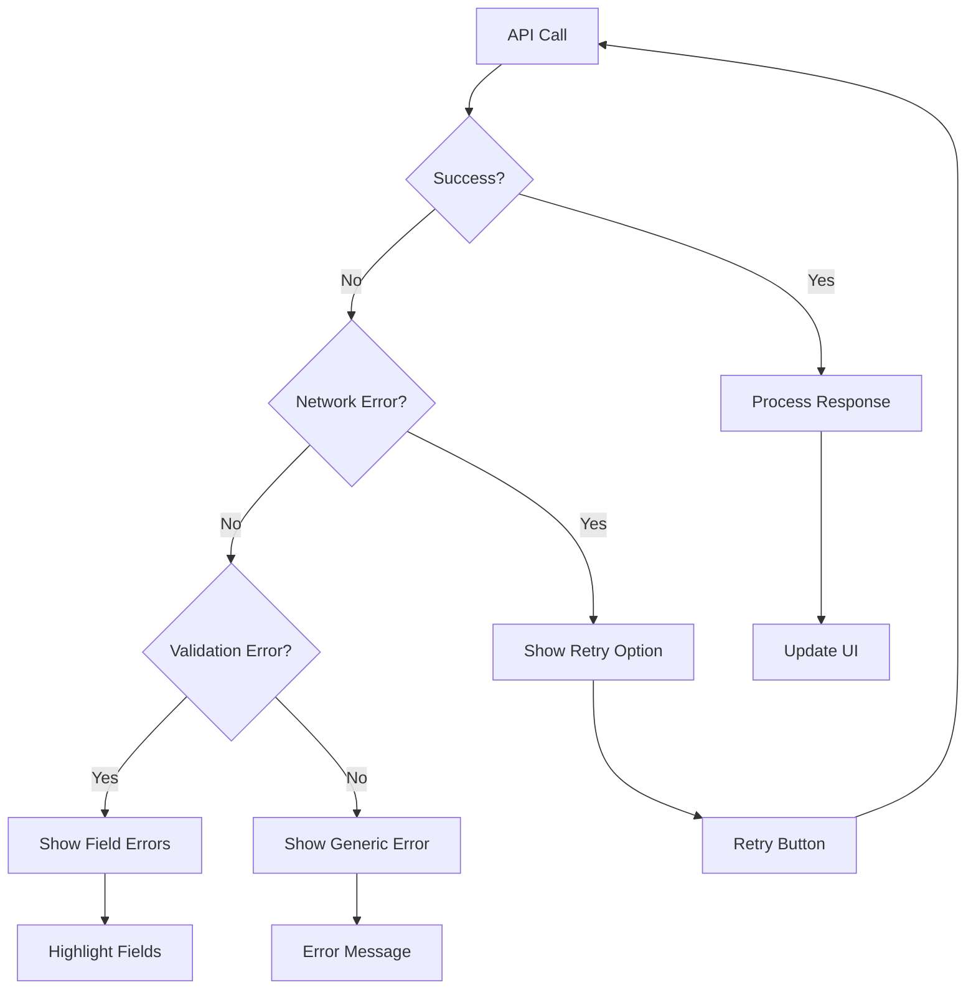

# Grant Application Module - Flowcharts

## 1. Complete User Journey

## 2. Application Status Workflow

## 3. Data Flow Architecture

## 4. Grant Discovery Process

## 5. Form Validation Flow

## 6. Admin Review Process

## 7. Error Handling Flow

