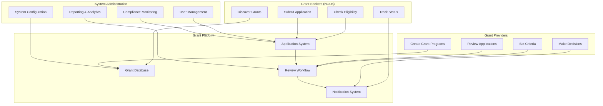
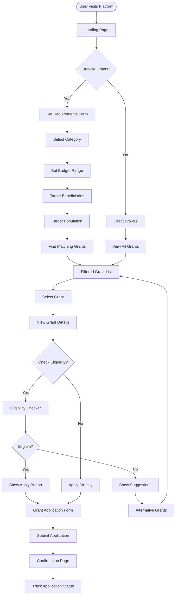
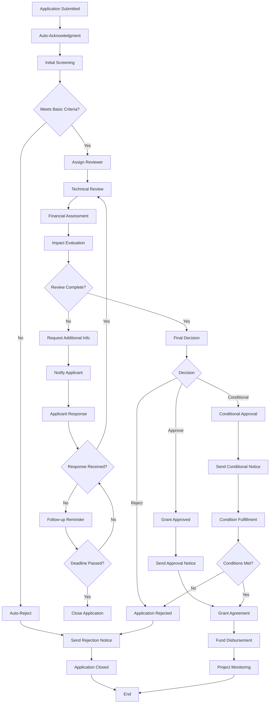
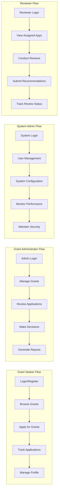
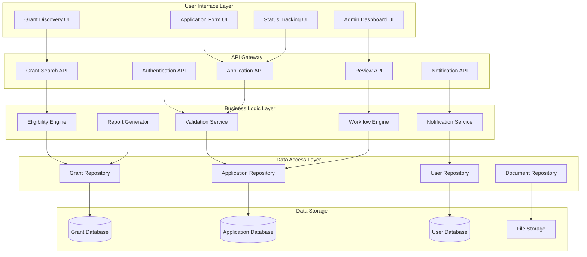
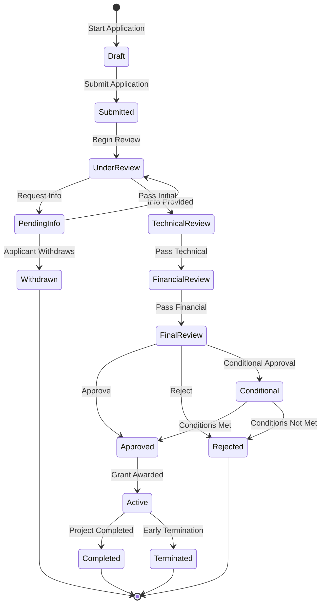
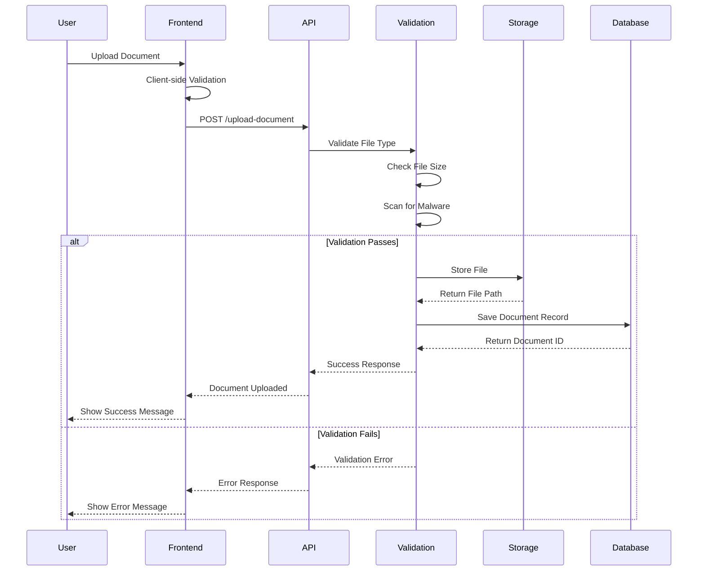
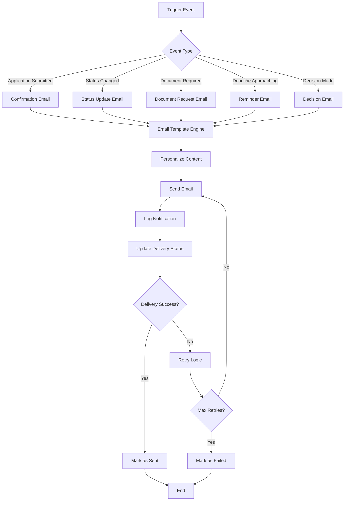
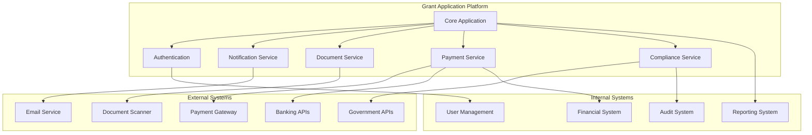

# Grant Application Flow Diagrams

## Complete Grant Application Process Flow

### 1. High-Level Grant Application Ecosystem

### 2. Detailed Grant Discovery Flow

### 3. Grant Application Form Flow

```mermaid
stateDiagram-v2
    [*] --> FormStart
    FormStart --> PersonalInfo : Fill Personal Details
    
    state PersonalInfo {
        [*] --> Name
        Name --> Email
        Email --> Phone
        Phone --> Organization
        Organization --> [*]
    }
    
    PersonalInfo --> ProjectInfo : Next Section
    
    state ProjectInfo {
        [*] --> Title
        Title --> Description
        Description --> Category
        Category --> Amount
        Amount --> Duration
        Duration --> [*]
    }
    
    ProjectInfo --> DocumentUpload : Next Section
    
    state DocumentUpload {
        [*] --> ProjectProposal
        ProjectProposal --> Budget
        Budget --> Timeline
        Timeline --> Certificates
        Certificates --> [*]
    }
    
    DocumentUpload --> Validation : Submit Form
    
    state Validation {
        [*] --> ClientValidation
        ClientValidation --> ServerValidation
        ServerValidation --> [*]
    }
    
    Validation --> Success : Valid
    Validation --> Error : Invalid
    Error --> PersonalInfo : Fix Errors
    Success --> [*]
```

### 4. Application Review Workflow

### 5. User Role-Based Access Flow

### 6. Data Flow Architecture

### 7. Application Status Lifecycle

### 8. Document Management Flow

### 9. Notification System Flow

### 10. Integration Architecture

---

*Document Version: 1.0*  
*Last Updated: January 15, 2025*  
*Author: Grant Application Team*