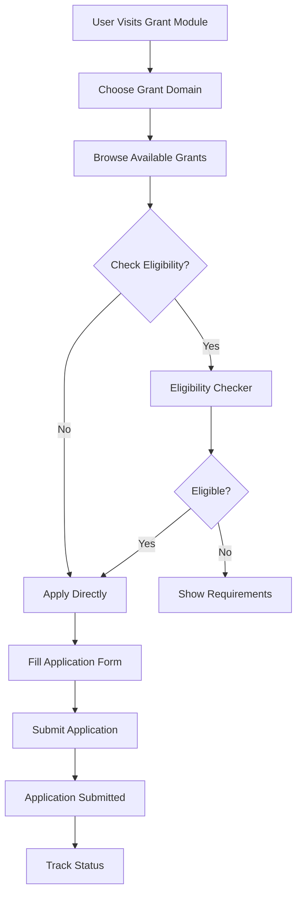
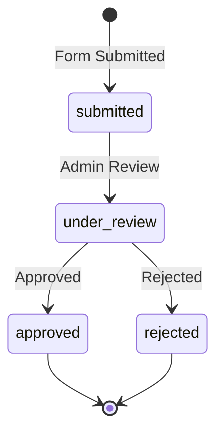
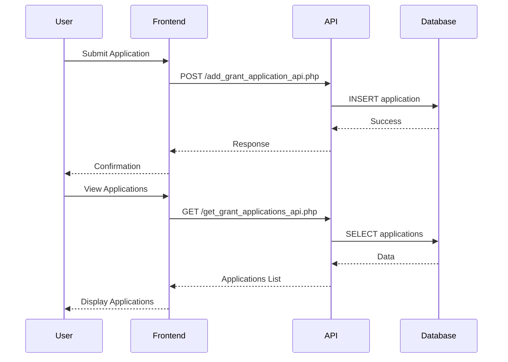

# Grant Application Module Documentation

## Overview
The Grant Application Module enables NGOs to discover, apply for, and manage grant applications through a comprehensive web interface.

## Module Components

### 1. Grant Discovery (`BrowseGrants.tsx`)
- Browse available grants by category
- Filter by amount, location, requirements
- Eligibility checker
- Requirements form for matching

### 2. Application Form (`GrantApplicationForm.tsx`)
- Multi-step application process
- Personal and organization information
- Project details and budget
- Document upload capability

### 3. Application Management (`GrantApplication.tsx`)
- View submitted applications
- Track application status
- Domain-based grant categories
- Application statistics

## User Flow

## Application Status Flow

## API Integration

## Grant Categories

1. **Education** - Digital literacy, infrastructure, capacity building
2. **Healthcare** - Rural access, community health, medical infrastructure  
3. **Ecology** - Climate action, biodiversity, green infrastructure
4. **Disaster Response** - Preparedness, emergency response, rehabilitation

## Key Features

- **Requirements Matching**: Automated grant discovery based on user criteria
- **Multi-step Forms**: Structured application process with validation
- **Status Tracking**: Real-time application status updates
- **Document Management**: Secure file upload and storage
- **Admin Review**: Workflow for grant review and approval

## Technical Stack

- **Frontend**: React + TypeScript
- **Backend**: PHP APIs
- **Database**: MySQL
- **Styling**: Tailwind CSS
- **Icons**: Lucide React