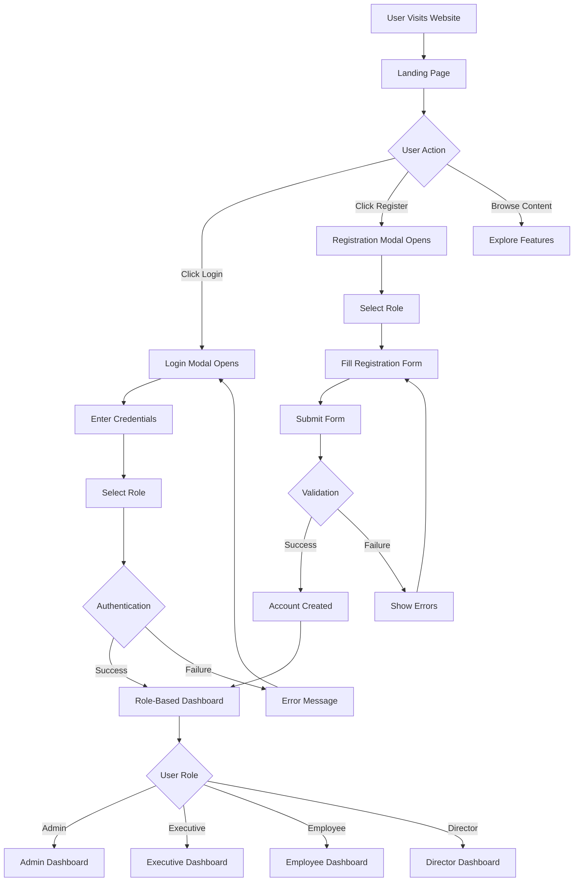
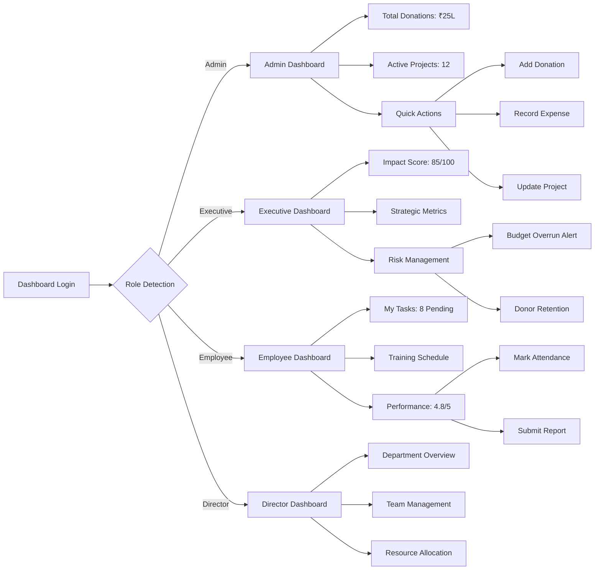
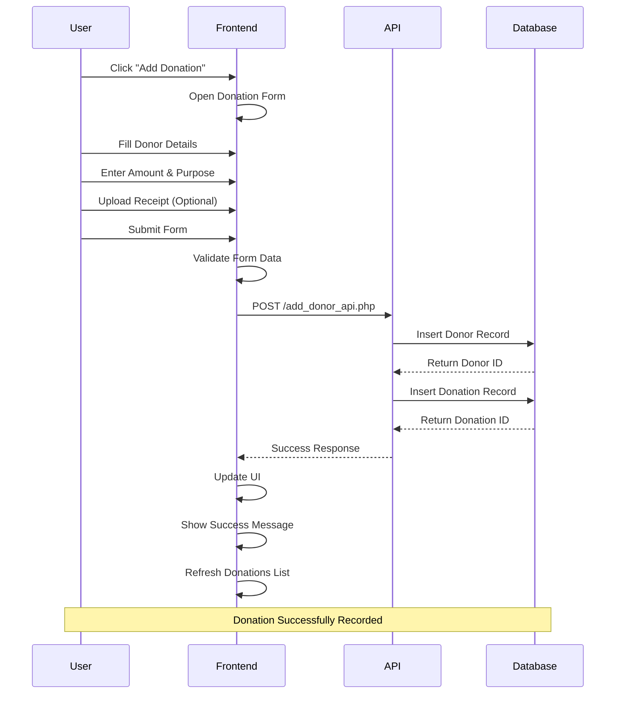
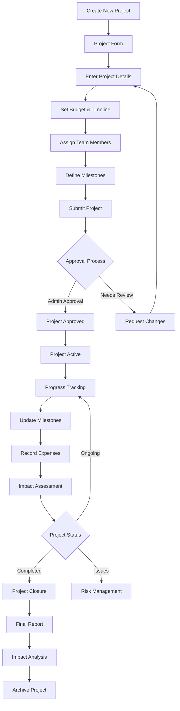
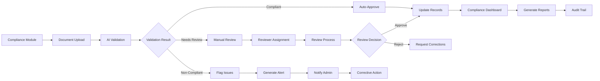
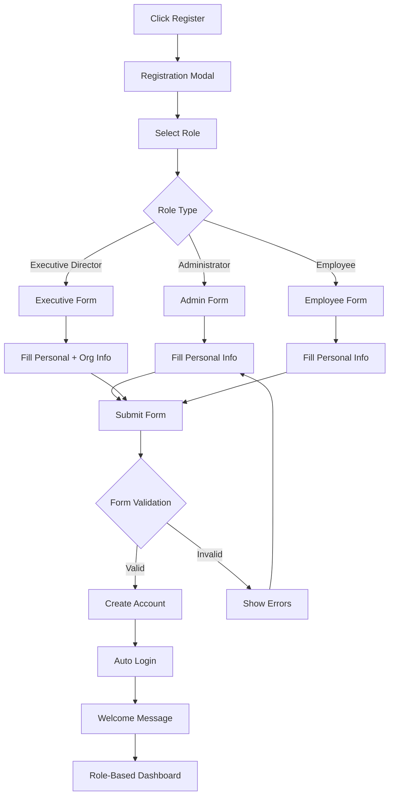
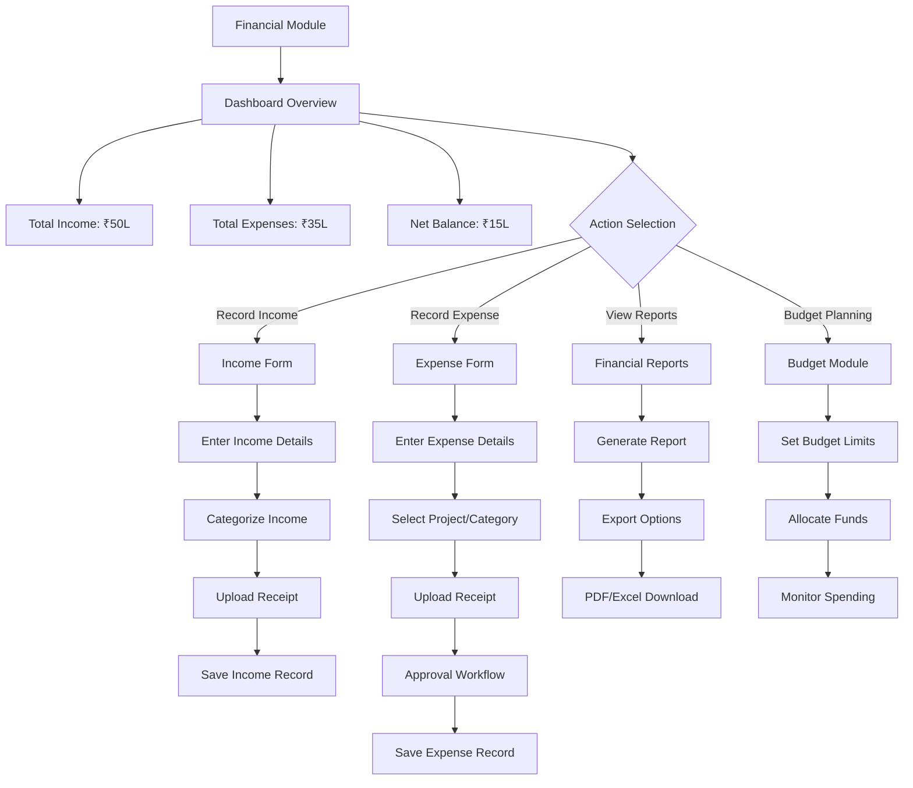
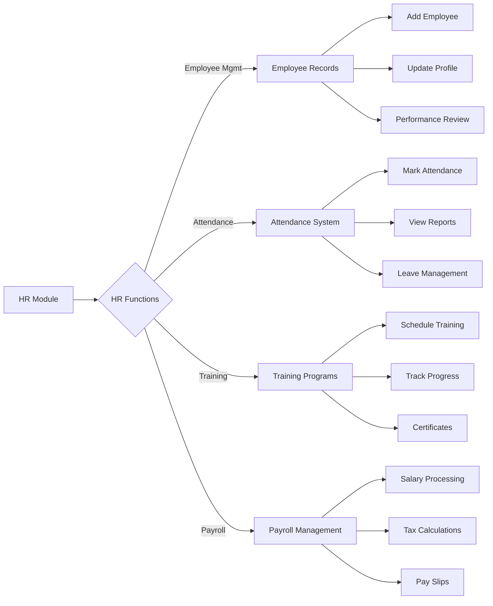
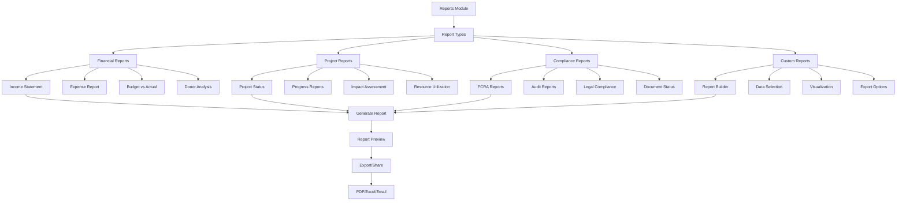

# NGO India - User Flow Diagrams

## Complete User Journey Flow

### 1. Landing Page to Dashboard Flow

### 2. Role-Based Dashboard Navigation

### 3. Module Access Flow

```mermaid
graph TD
    A[Dashboard Sidebar] --> B{Module Selection}
    
    B -->|Donors| C[Donor Management]
    C --> C1[View Donors List]
    C --> C2[Add New Donor]
    C --> C3[Track Donations]
    C --> C4[Generate Receipts]
    
    B -->|Finances| D[Financial Tracking]
    D --> D1[Income Overview]
    D --> D2[Expense Management]
    D --> D3[Budget Planning]
    D --> D4[Financial Reports]
    
    B -->|Projects| E[Project Monitoring]
    E --> E1[Active Projects]
    E --> E2[Create New Project]
    E --> E3[Progress Tracking]
    E --> E4[Impact Assessment]
    
    B -->|Compliance| F[Compliance Module]
    F --> F1[FCRA Compliance]
    F --> F2[Legal Policies]
    F --> F3[Document Management]
    F --> F4[AI Validation]
    
    B -->|HR| G[HR Management]
    G --> G1[Employee Records]
    G --> G2[Performance Reviews]
    G --> G3[Training Programs]
    G --> G4[Attendance System]
    
    B -->|Reports| H[Reports & Analytics]
    H --> H1[Financial Reports]
    H --> H2[Impact Reports]
    H --> H3[Compliance Reports]
    H --> H4[Custom Reports]
```

### 4. Donation Process Flow

### 5. Project Creation & Monitoring Flow

### 6. Compliance Management Flow

### 7. User Registration Flow

### 8. Financial Tracking Flow

### 9. HR Management Flow

### 10. Reporting & Analytics Flow

## Key User Interactions

### Dashboard Quick Actions
1. **Admin Dashboard:**
   - Add Donation → Opens donation form
   - Record Expense → Opens expense form
   - Update Project → Opens project update form

2. **Executive Dashboard:**
   - Review Budget → Opens financial module
   - Approve Initiative → Opens project approval
   - Generate Report → Opens reports module

3. **Employee Dashboard:**
   - Mark Attendance → Updates attendance record
   - Submit Report → Opens report submission form
   - Request Leave → Opens leave request form

### Module Navigation
- **Sidebar Navigation:** Single-click module switching
- **Breadcrumb Navigation:** Easy back navigation
- **Quick Search:** Global search functionality
- **Notifications:** Real-time alerts and updates

### Data Flow Patterns
1. **Create Operations:** Form → Validation → API → Database → UI Update
2. **Read Operations:** Request → API → Database → Response → UI Render
3. **Update Operations:** Form → Validation → API → Database → UI Refresh
4. **Delete Operations:** Confirmation → API → Database → UI Remove

This comprehensive flow documentation ensures that every user interaction is mapped and the complete journey from landing page to specific module functionality is clearly defined.